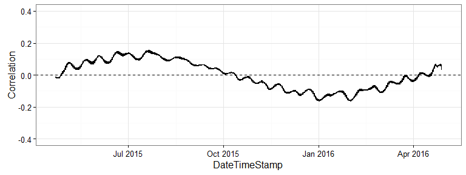
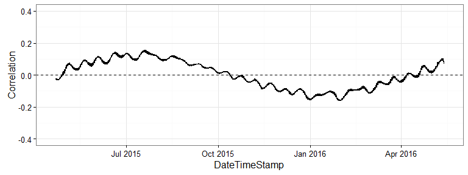

# README
Marcus W. Beck, beck.marcus@epa.gov  

### Files

All data files created from raw data in `ignore` folder using `R\dat_proc.R`

`dum.RData` Dumbarton time series data from `Dumbarton_07022013_04282016_L1.csv`

`dum_evalcor.RData` ggplot of tidal/sun correlations at Dumbarton

`new.RData` Newark time series data from `Newark_04212015_05132016_L1 (1).csv`

`new_evalcor.RData` ggplot of tidal/sun correlations at Newark

### Correlation between sun angle and tidal change at each site

Dumbarton

Newark

